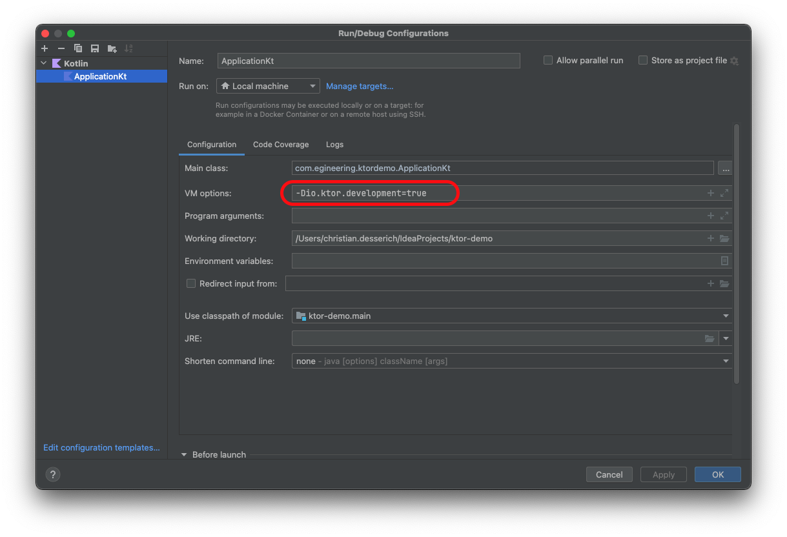

# Ktor and Kotlin

## Run Configuration
### IntelliJ IDEA / Android Studio

Just import the existing code into a new project or clone in IDEA. Then, click the green arrow
(►) next to `fun main()` to run the server. After that, it will be in your Run/Debug
Configurations.

#### Ktor Auto-reload

To get the auto-reload to work for IntelliJ IDEA / Android Studio, you have to add `-Dio.ktor.development=true` to the
JVM args in the server's run configuration. Also note that the build output directory is set in code as `build`, so if
you have IntelliJ set to use its own builder and not the Gradle Wrapper, you might have to reconfigure you build
directory accordingly.

IntelliJ IDEA / Android Studio have their own hot-swapping mechanism, and sometimes it gets confusing which one is doing
what. To eliminate that, you can go to "Preferences..." (macOS) or "Settings..." (Windows/Linux) ->
"Build, Execution, Deployment" -> "Debugger" -> "HotSwap", under "Java" you can set the
"Reload classes after compilation:" setting to "Never". Unfortunately, you still have to kick the project build off
manually with "Build" -> "Build Project" or with the hotkey assigned to that function. Be aware that Ktor doesn't
seem to pick up changes when they happen, but rather the next time you execute some operation in the app. Also,
unfortunately, this is a global setting so if you want it on for a different project you'll have to toggle it back on.

More info: https://ktor.kotlincn.net/servers/autoreload.html

### Command Line / Gradle

To run, simply run the run command with the Gradle Wrapper via a command line in the projects working directory:
`./gradlew run`.

#### Ktor Auto-reload

Similar to the above, development mode has to be enabled. In the `application` block in the `build.gradle.kts` file
you have to have the snippet `applicationDefaultJvmArgs = listOf("-Dio.ktor.development=true")` defined. (This is
already done in this project.

You can open one shell and run the Gradle auto-build command: `./gradlew -t build`, which will watch for changes and
build automatically when they are detected. Then in another shell, run the app as above: `./gradlew run`. These tasks
could also certainly be added as run configurations in IDEA or any other IDE for convenience's sake.
